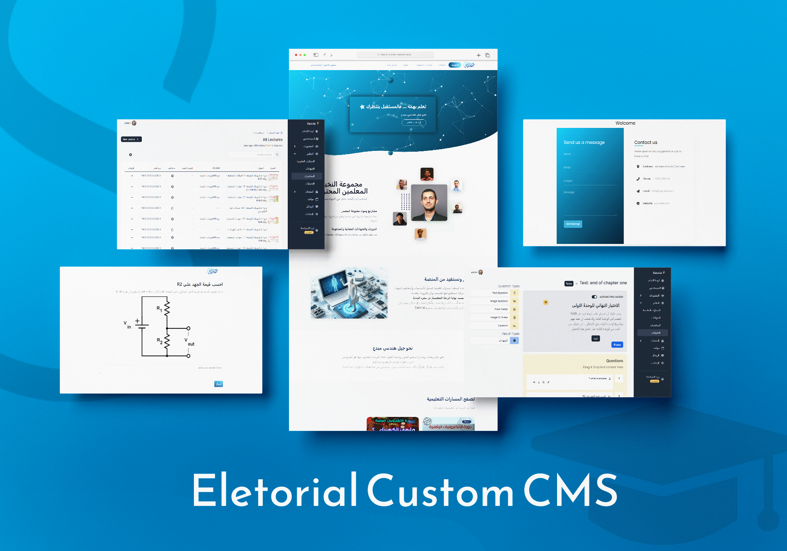

<div align="center">
    <a href="https://salahbakhash.com"><h1 align="center">Eletorial.com</h1></a>

A custom LMS with other test/exams + blog + electronical products section for the best electronical engs in the arabic-speaking world [Dr. Eng. walid isaa](https://www.shu.ac.uk/about-us/our-people/staff-profiles/walid-issa#firstSection), i built this website using [Laravel](https://laravel.com/), [Bootstrap](https://getbootstrap.com/) and deployed to [Hostinger](https://hostinger.com?REFERRALCODE=1SALAH22).

<a target="_blank" href="https://eletorial.com">
    
</a>

</div>

<br/>

# About this project

this LMS is based on what the client i made this project for needed, it can be helpful for anybody who wants to have a solid base and make his own changes to save some time (quite a lot of time)

## Cloning / Forking

Feel free to clone this repo and use it as you like. However, it would be better if you forked it and made your changes there so that I can review and potentially merge them into this repo (if they are good enough).

## Running Locally

```sh-session
git clone https://github.com/salahWD/Laravel-LMS-System
cd Laravel-LMS-System
```

Then install dependencies and run the development server:

```sh-session
npm install
npm run dev
```
